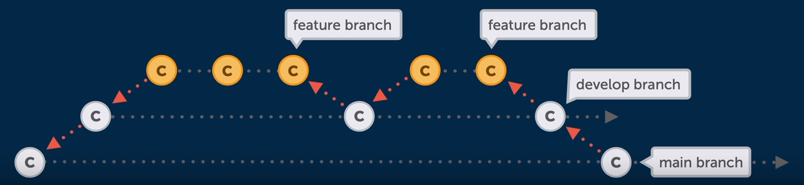

# Medium to advanced Git concepts

## The "perfect" commit

### The golden rule 
> Only combine changes from the same topic in a single commit.


### Control over the staging area
One cool feature of the staging area, is that we can actually add certain part of a file that we changed instead of the whole file. So, we want to decide on the patch level, what to include and what not:

```bash
$ git add -p <file_name>
```

With that, Git steps through every single chunk of changes of the file with us and it asks us a simple question "Do we want to add this chunk to the staging area or not?".


### The commit message
Parts of the commit message:
1. Subject: concise summary of what happened
2. Body: more detailed explanation
    1. What is now different than before?
    2. What's the reason for the change?
    3. Is there anything to watch out for / anything particularly remarkable?


## Branching strategies

### Writing a convention
You need a written best practive of how work is ideally structured in your team, to avoid mistakes and collisions. It highly dependes on your team / team size, on your project and how you handle releases.

### Integrating changes & structuring releases
#### Mainline development
> "Always be integrating"
- Fewer branches
- It requires relatively small commits and a high-quality testing & QA standars

#### State, Release and Feature Branches

- Different types of branches fulfill diferrent types of jobs.
- Long-running branchs:
    - Exists through the complete lifetime of the project
    - Often, they mirror "stages" in your dev life cycle
    - Common convention: No direct commits!
- Shot-lived branches:
    - For new features, bug fixes, refactorings, experiments, etc
    - Will be deleted after integration
- Flows:
    - [Github Flow](https://docs.github.com/en/get-started/quickstart/github-flow)
    - [Git Flow](https://git-scm.com/docs/gitworkflows)
    - [Gitlab Flow](https://docs.gitlab.com/ee/topics/gitlab_flow.html)


## Merge conflicts
Merge conflict occurs when integrating commits from different sources. They are not limited to only merging branches, conflicts can also happen when rebasing, when performing a cherry pick or a pull, or even when reapplying a stash. All of these actions perfmorm some kind of integration.

You can't ignora a merge conflict, you have to deal with it before you can continue your work. But dealing with a merge conflict doesn't necessarily mean you have to resolve it, you can also undo it and this is sometimes very helpful:

```bash
$ git merge --abort
```
Or:
```bash
$ git rebase --abort
```

## Merge vs Rebase
### How Merge works
When Git performs a merge it looks for three commits, the common ancestor commit and the endpoints of each branch. The integration is simple, Git just adds all the new commits from branch B on top of the common ancestor commit. This is called Fast Foward Merge. Both branches then share the exact same history. To make an integration Git will have to create a new commit that contains the difference between the branches, and this is what we call a merge commit. Its purpose is to connect two branches just like a knot.

### Rebase
Some people doesn't like merge commits, they want the project history to look like a straight line. This is what happens with rebase.
```bash
$ git rebase <branch_name>
```

First, Git will remove all commits on branch A that happened after the common ancestor commit (they are parked/saved temporarily). Then Git applies the new commits from branch B. In the final step, those parked commits need to be included, so the new commits from branch A are positioned on top of the integrated commits from branch B. They are "rebased", and the result looks like development had happened in a straight line, there is no merge commit that contains all the combined changes, we preserve the original commit structure.

There's one more thing to understand bout rebase, it rewrites commit history. Commits has only a handful of important properties like the author, date change and who its parent commit is. And changing anything any of this information, it effectively creates a completely new commit and with a new commit hash. So we writing history like that is not a problem for commits that haven't been pushed yet. But if you're rewriting commits that have already been pushed to a remote you might be in trouble. Because another developer might have based their work on the original commits.
> Do NOT use Rebase on commits that you've already pushed on a remote repository.

Instead, use it for cleaning up your local commit history before merging it into a shared team branch.

<br>
<br>
<br>

<hr>

<small>
Sources:
<ul>
    <li>
        <a href="https://www.youtube.com/watch?v=Uszj_k0DGsg">Git for Professionals Tutorial - Tools & Concepts for Mastering Version Control with Git
        </a>
    </li>
</ul>
</small>